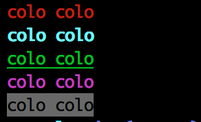

colo
=========

[](https://travis-ci.org/yosuke-furukawa/colo)

node.js colorize module.

```javascript
var colo = require("colo");


console.log(colo.red("colo colo"));
console.log(colo.cyan.bold("colo colo"));
console.log(colo.green.underline("colo colo"));
console.log(colo.magenta.italic("colo colo"));
console.log(colo.grey.inverse("colo colo"));
```



colo is simple colorize module. No dependencies.


